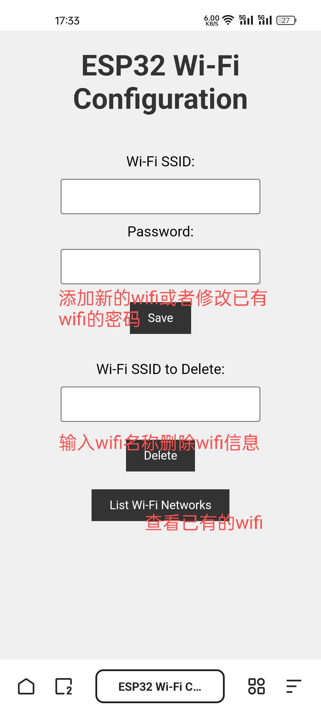

# ESP32_XunfeiSpark
## 简介
本项目使用esp32接入讯飞星火大模型实现语音聊天，通过一块普通的屏幕显示对话内容，并可以使用手机或电脑连接esp32的热点打开特定网页进行网络配置。代码中使用的是星火大模型v4.0的API，使用前请先购买Spark4.0 Ultra个人认证免费包(200万tokens)。
## 使用说明
### 讯飞相关服务开通教程
111
### 项目开发环境
使用vscode中的platformIO插件
### 硬件使用清单
ESP-WROOM-32、INMP441全向麦克风、MAX98357 I2S音频放大器模块、喇叭、1.8寸（128x160）RGB_TFT屏幕、面包板（400孔85x55mm）两块、面包板跳线若干、数据线一条
- 注意事项：其中ESP32需要安装相应的驱动程序
### 串口监视器推荐
https://serial.keysking.com
- 设置参考：

### 网络配置教程
esp32接电后，初始nvs中并没有wifi信息，提示网络连接失败，需要手动进行配置。
首先，等待esp32打开的热点ESP32-Setup出现在你的手机或电脑的WLAN可用网络列表中，然后连接该热点，密码为12345678。连接好之后，在浏览器中打开http://192.168.4.1，即可进行网络的配置。配置完成后，再次重启即可成功联网。

### 项目部署教程
111
## 项目成品图参考
