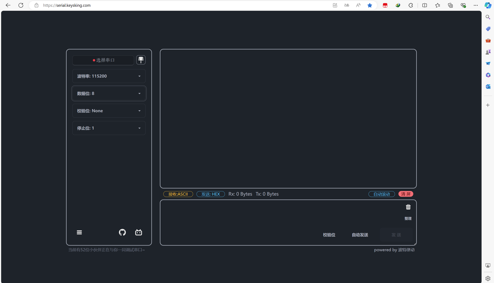

# ESP32_AI_XunfeiSpark
## 简介
本项目使用esp32接入讯飞星火大模型实现语音聊天，支持连续对话，AI说完之后会自动开启录音，在8秒内没有说话就会结束本轮对话，要再按boot键开启下一轮对话（历史对话记录不会清除）。通过一块普通的屏幕显示对话内容，并可以使用手机或电脑连接esp32的热点打开特定网页进行网络配置。代码中使用的是星火大模型v4.0的API，使用前请先购买Spark4.0 Ultra个人认证免费包(200万tokens)。
## 使用说明
### 讯飞相关服务开通教程
111
### 项目开发环境
使用vscode中的platformIO插件
### 硬件使用清单
ESP-WROOM-32、INMP441全向麦克风、MAX98357 I2S音频放大器模块、喇叭、1.8寸（128x160）RGB_TFT屏幕、面包板（400孔85x55mm）两块、面包板跳线若干、数据线一条
- 注意事项：其中ESP32需要安装相应的驱动程序
### 硬件接线
麦克风：
- VDD -> 3.3v
- GND -> GND
- SD -> GPIO22
- WS -> GPIO15
- SCK -> GPIO4

音频放大模块：
- Vin -> VIN
- GND -> GND
- LRC -> GPIO25
- BCLK -> GPIO26
- DIN -> GPIO27

1.8寸OLED屏幕：
- VDD -> VIN
- GND -> GND
- SCL -> GPIO18
- SDA -> GPIO23
- RST -> GPIO12
- DC -> GPIO16
- CS -> GPIO5

### 串口监视器推荐
https://serial.keysking.com
- 设置参考：

### 程序执行流程
setup初始化：
- 初始化串口通信、引脚配置、屏幕、录音模块Audio1。
- 启动AP模式创建热点。
- 启动Web服务器。
- 调用wifiConnect()连接网络，连接完成后调用getTimeFromServer()从百度服务器获取当前日期和时间。
- 初始化音频输出模块Audio2的引脚和音量，调用getUrl()初始化url和url1（分别用于星火大模型和语音识别的本地鉴权）。

loop循环：
- 轮询处理WebSocket客户端消息，检查和处理从服务器接收的消息、发送等待发送的数据，维护与服务器的连接。
- 每隔四分钟更新一次鉴权参数。
- 如果正在播放语音，调用voiceplay()函数播放剩余语音。
- 调用audio2.loop()确保音频流的连续和稳定播放。
- 没有音频播放时，熄灭板载LED；有音频播放时，点亮板载LED。
- 检测到板载boot按键被按下时，连接WebSocket服务器1（语音识别）并开启录音，在8秒内没有说话就会结束本轮对话，要再按boot键开启下一轮对话（历史对话记录不会清除）。如果有说话，录音结束后调用讯飞STT服务API接口将语音转文本。如果文本内容为空，回复“对不起，我没有听清，可以再说一遍吗？”；不为空时连接WebSocket服务器，将文本发送给星火大模型，然后接收大模型回复文本，并分段发送给百度的TTS服务转语音播放，同时在屏幕上显示回复文本内容。
- 检测到AI说话完毕后，自动连接WebSocket服务器1（语音识别）并开启录音，后面的与上一条相同。
### 功能介绍
#### 语音对话功能
ESP32连接网络后，按下板载的boot键即可开始说话。项目使用INMP441全向麦克风模块接受用户的语音输入，然后调用科大讯飞的STT服务API接口，将语音数据发送进行语音识别，接收返回的信息并提取出识别结果。接收到识别结果后，调用科大讯飞的星火大模型Spark4.0 Ultra的API接口，将识别结果发送至大模型，由大模型给出回答后，从返回的信息中提取出回答内容，并分段发送给百度的TTS服务，最终输出语音回答。
#### 便捷配网功能
网络连接通过读取ESP32 flash的NVS中存储的Wi-Fi信息实现。设备启动后开始联网时，板载LED会闪烁，屏幕显示相应的连接状态信息。ESP32设置为AP模式，创建临时网络热点ESP32-Setup（初始密码为12345678）。手机或电脑连接此网络后，浏览器访问http://192.168.4.1，出现配置网页界面：

通过该网页界面，即可进行网络的配置。
配置界面包含以下功能：
·输入目标Wi-Fi的SSID和密码后，点击Save按钮提交。如果Wi-Fi不存在，则添加到ESP32 flash的NVS中；如果存在，则修改密码。操作完成后，屏幕显示信息。
·输入目标Wi-Fi的SSID后，按下Delete按钮，从ESP32 flash的NVS中删除Wi-Fi信息。操作完成后，屏幕显示信息。
·点击List Wi-Fi Networks按钮，查看NVS中已存储的所有Wi-Fi信息。
#### 屏幕显示功能
使用1.8寸（128x160）RGB_TFT屏幕显示用户与大模型的对话信息、网络配置及连接状态等信息。
### 项目部署教程
111
## 项目成品图参考
